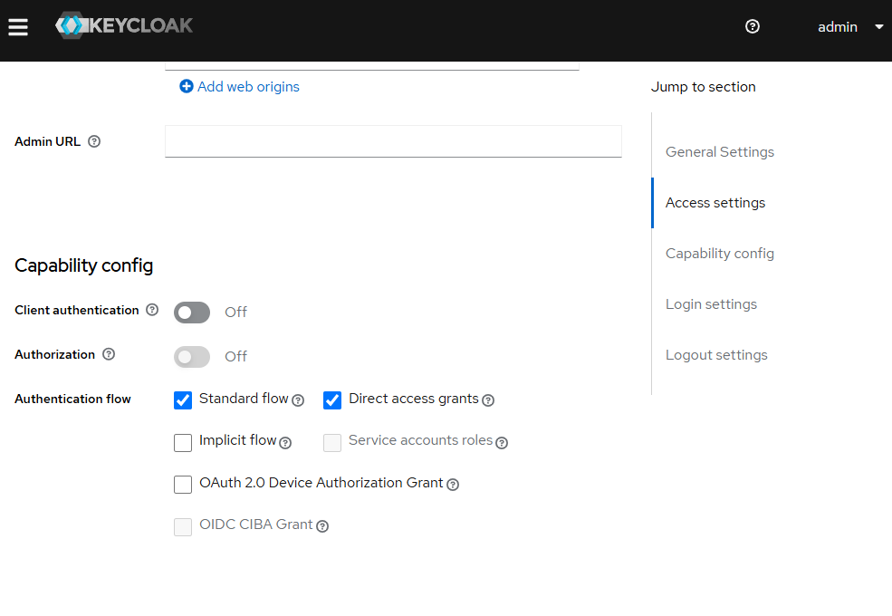
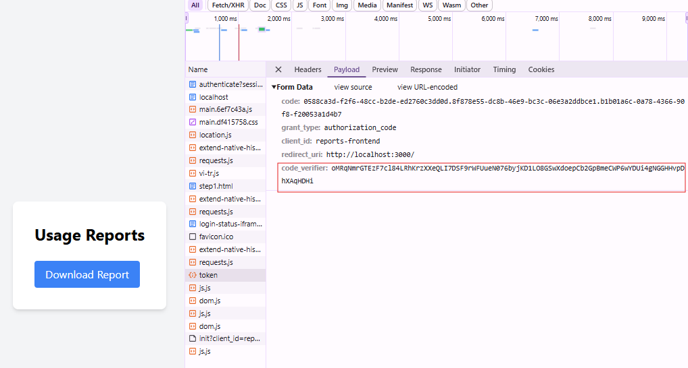
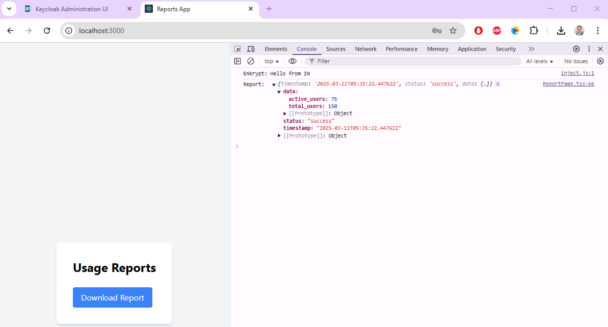
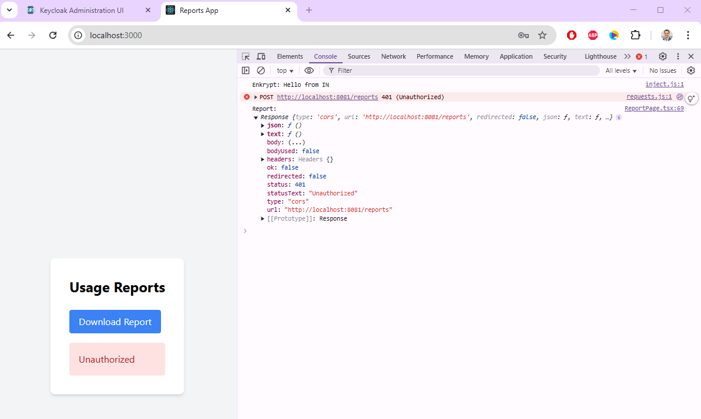

# architecture-sprint-8

## Задача

Вам нужно улучшить безопасность приложения, заменив Code Grant на PKCE. Затем необходимо подготовить API для работы с отчётом.  

### Что нужно сделать

1. Реализуйте PKCE. Его нужно добавить к существующим приложениям — фронтенду и Keycloak. Чтобы разобраться, изучите [официальную документацию](https://www.keycloak.org/docs/latest/server_admin/index.html#device-authorization-grant).

2. Создайте бэкенд-часть приложения для API. Выберите удобный для вас язык — Pyhton, Java, C# или любой другой. Добавьте API /reports в этот бэкенд для передачи отчётов. Тут не требуется поход в базы данных, ограничьтесь генерацией произвольных данных.

#### Детали

- Бэкенд отдаёт данные только пользователям с ролью prothetic_user.
- Бэкенд проверяет валидность подписи токена. Если валидация не прошла, он выдаёт ошибку 401.

## Решение

### Как включить PKCE в Keycloak?

PKCE не требует отдельной настройки в Keycloak, но клиентское приложение должно правильно его использовать.
    
1. Настроить клиент в Keycloak.

Keycloak Admin Console - Clients: должен быть включен Standard Flow Enabled.

    
2. Использование PKCE на клиенте.

Когда клиент запрашивает токен, он должен передать code_challenge и code_challenge_method в запросе авторизации.

На клиенте мы используем библиотеку "keycloak-js", поэтому PKCE реализуется из коробки. Необходимо только указать алгоритм хэширования при инициализации.
```js
const keycloakProviderInitConfig = {
  pkceMethod: "S256",
}
```



### Бэкенд-часть приложения для API

- [main.py](./API/main.py)
- [requirements.txt](./API/requirements.txt)
- [Dockerfile](./API/Dockerfile)

В бэкенд части необходимо проверить токен, который мы получили от клиента. Воспользуемся библиотекой PyJWKClient, обратимся к серверу Keycloak, и получим ключ. Далее мы сравним его с тем, что мы получили от клиента.

**ВАЖНО!**
Поскольку оба сервиса запущены в докере, то внутри него 2 контейнера не могут обращаться к друг другу через localhost, поэтому нужно использовать имя контейнера в качестве имени хоста.
Поэтому для сервера Keycloak мы используем этот URL: http://keycloak:8080


```python
JWKS_URL = "http://keycloak:8080/realms/reports-realm/protocol/openid-connect/certs"
jwks_client = PyJWKClient(JWKS_URL)
    
# Извлекаем ключ
signing_key = jwks_client.get_signing_key_from_jwt(token)

# Декодирование и валидация подписи
decoded_token = jwt.decode(
    token,
    signing_key,
    algorithms=["RS256"],  # Алгоритм подписи
    issuer=ALLOWED_ISSUER  # Проверяем, кто выдал токен
```

Если токен в порядке, докодируем его и получим роли пользователя. Нам необходимо убедиться, что у пользователя есть роль "prothetic_user"

```python
roles = parsed_token.get("realm_access", {}).get("roles", [])
return "prothetic_user" in roles
```

## Teст

Пользователь "prothetic3@example.com" с ролью "prothetic_user", может скачать отчет.


Пользователь "user1@example.com" с ролью "user", не может скачать отчет.


### FAQ

- Почему нужен PKCE?

PKCE был создан для защиты OAuth 2.0 Authorization Code Flow от атак "code interception" (перехвата кода).
Без PKCE злоумышленник может перехватить authorization_code и обменять его на access_token, если клиент не использует client_secret (например, в SPA или мобильных приложениях).

- Как происходит атака перехвата?

Когда клиент делает редирект на авторизацию, сервер Keycloak после успешного входа отправляет authorization_code обратно в URL (редиректит пользователя на redirect_uri).
Например: https://myapp.com/callback?code=abc123
Если злоумышленник перехватил этот URL (например, через небезопасные логи, вредоносный браузерный плагин, MITM-атаку), он получает authorization_code.

- Как работает PKCE?

PKCE решает эту проблему, добавляя к процессу дополнительную проверку с использованием code_challenge и code_verifier.

- Почему это безопасно?

Злоумышленник может украсть authorization_code, но он не знает code_verifier, без которого обмен кода на токен невозможен.
code_challenge был заранее сохранён Keycloak, а code_verifier передаётся только при обмене кода на токен.

- Почему злоумышленник не может украсть code_verifier?

Потому что code_verifier не передаётся в URL, а отправляется в защищённом POST-запросе. Этот запрос передаётся через HTTPS!
- authorization_code отправляется в URL, который могут перехватить.
- code_verifier передаётся в теле защищённого POST-запроса, и если используется HTTPS, его невозможно перехватить.

